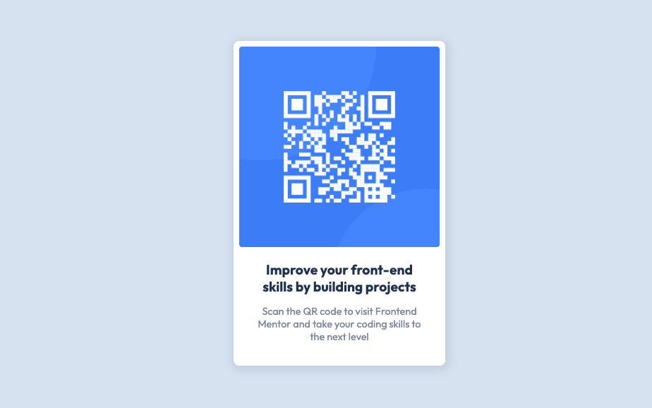

# Frontend Mentor - QR code component challenge solution

This is a solution to the [QR code component challenge on Frontend Mentor](https://www.frontendmentor.io/challenges/qr-code-component-iux_sIO_H).

## Table of contents

- [Overview](#overview)
  - [The challenge](#the-challenge)
  - [Screenshot](#screenshot)
  - [Links](#links)
- [My process](#my-process)
  - [Built with](#built-with)
  - [What I learned](#what-i-learned)
- [Author](#author)


## Overview

### The challenge

Your challenge is to build out this QR code component and get it looking as close to the design as possible.

### Screenshot




### Links

- Live Site URL: [Pricing Component](https://peppy-bubblegum-f87f78.netlify.app)

## My process

### Built with

- Semantic HTML5 markup
- CSS custom properties
- Flexbox
- Mobile-first workflow


### What I learned

- Better Understanding of CSS Box Sizing
- Better Understanding of CSS Variables

```css

*{
    margin: 0;
    padding: 0;
    box-sizing: border-box;
}
:root{
    --white: hsl(0, 0%, 100%);
    --light-gray: hsl(212, 45%, 89%);
    --grayish-blue: hsl(220, 15%, 55%);
    --grayish-blue-transparent: hsla(220, 15%, 55%, 0.2);

    --dark-blue: hsl(218, 44%, 22%);
    --body-font: 'Outfit', sans-serif;
}

body{
    background-color: var(--light-gray);
    padding: 5rem;
    font-family: var(--body-font);
}

```


## Author
- Frontend Mentor - [@Master-Osaro](https://www.frontendmentor.io/profile/yourusername)
- Twitter - [@iyoha_osaro](https://www.twitter.com/yourusername)
